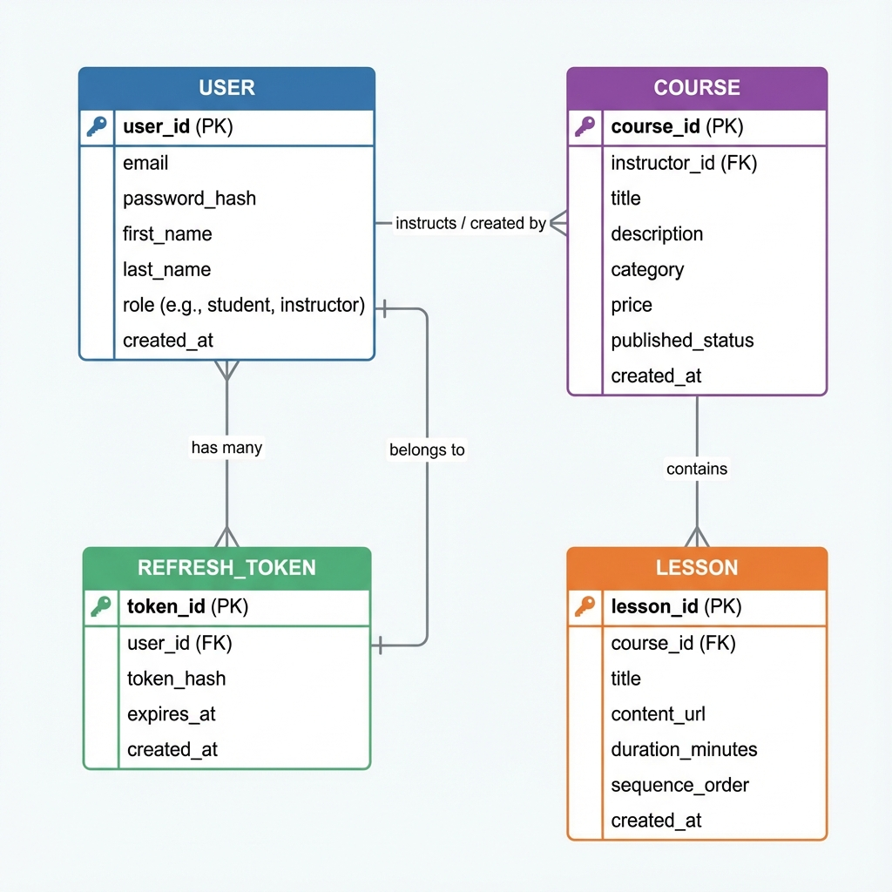
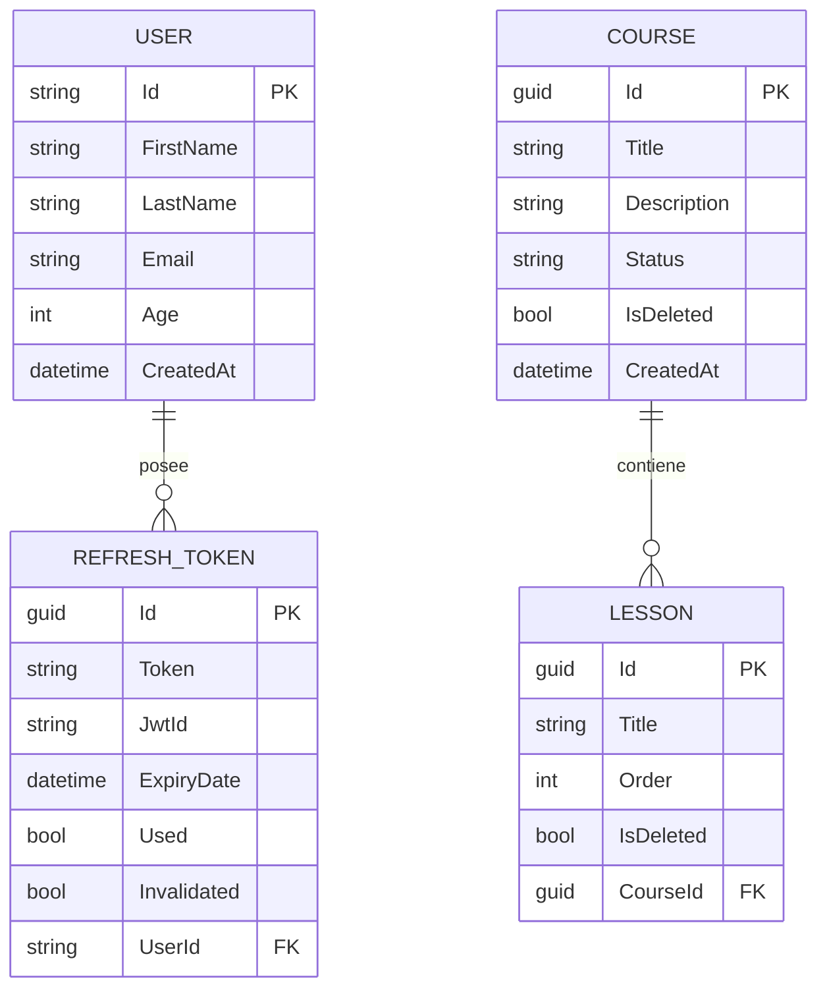
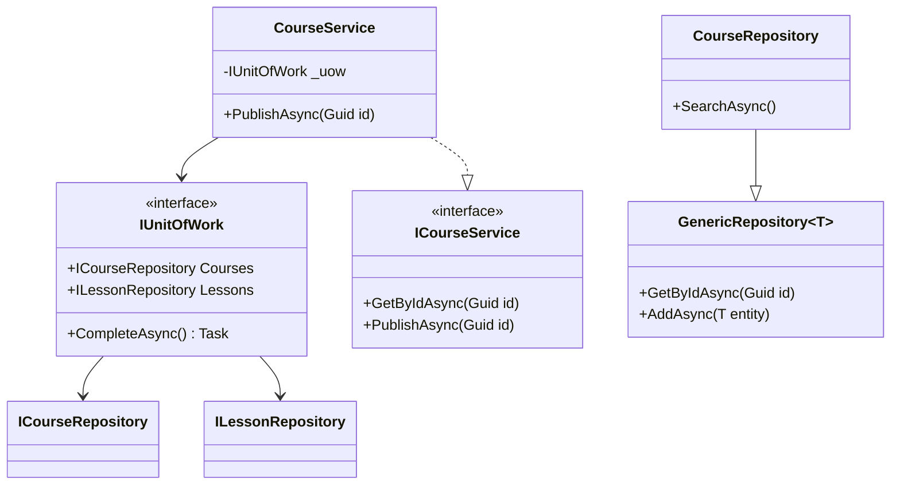

# Diagramas Técnicos - CoursePlatform

Este documento contiene la representación visual de la base de datos y la arquitectura de software del proyecto.

## 📊 Diagrama de Entidad-Relación (ERD)
Representa la estructura de persistencia en PostgreSQL.

---

## 🏗️ Diagrama de Clases (Arquitectura)
Muestra la implementación del patrón Repository, Unit of Work y la capa de Servicios.

